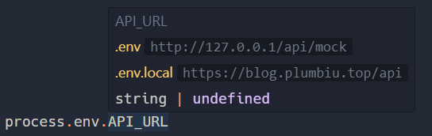

# env-ally

> Display .env.\* file config in your code.

## Install

serach `Env Ally` in vscode marketplace,

## Usage

Hover in the `process.env.*` or `import.meta.env.*`(for vite) code.

## Todo

- [ ] support more language