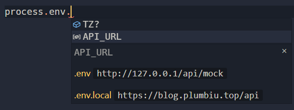

# env-ally

> Dotenv extension to display the env data. powered by [dotenv](https://github.com/motdotla/dotenv)

# Install

serach `Env Ally` in vscode marketplace, or go to [vscode-marketplace-web](https://marketplace.visualstudio.com/items?itemName=plumbiu.vscode-env-ally)

# Feature

- support js, ts, python, go and more(see [dotenv/quickstart](https://www.dotenv.org/docs/quickstart))
- support js framework(vue、react、svelte and more)
- small size

# Usage

**Hover in the code related env**:

**Auto complete:**

# Related

- [dotenv-vscode](https://github.com/dotenv-org/dotenv-vscode)

# Todo

- [x] support more language
- [x] tooltip
- [ ] support scope (in monorepo, env data will have same key, we need add scope)
